# ios-multiscreen-starter

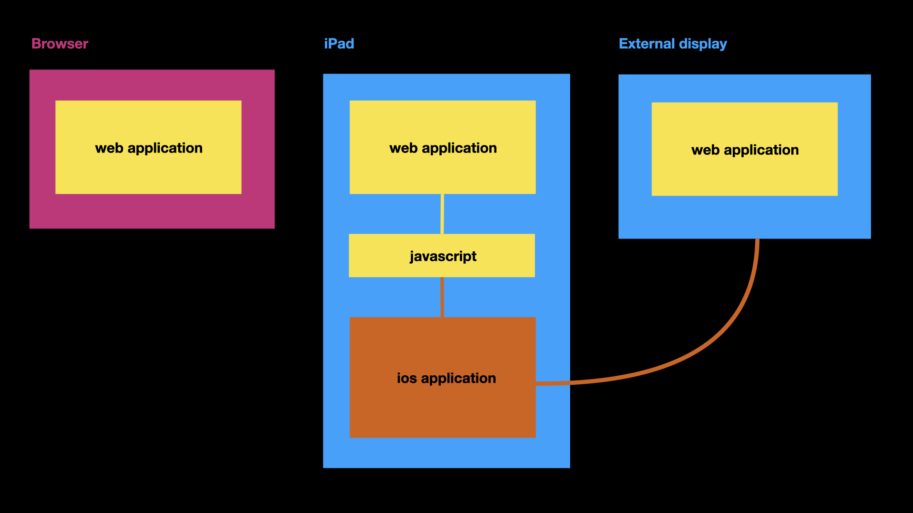

Starter kit for developing hybrid iOS / web applications designed to run on a "controller" iOS device and mirrored to a passive external display.

We welcome [improvements and contributions](https://github.com/sfomuseum/ios-multiscreen-starter/issues).

## Important

This is meant to be a working _reference implementation_ for other applications. It is not designed to be an abstract container in to which a web application is placed. You don't need to be an XCode or a Swift expert but there is some expectation that you know the basics of how iOS applications work and can put together a (simple) project and compile it from scratch.

For a fuller discussion of motivations behind the project please have a look at the [iOS Multi-screen Starter Kit](https://millsfield.sfomuseum.org/blog/2020/11/18/multiscreen/) blog post.

## What does it do?

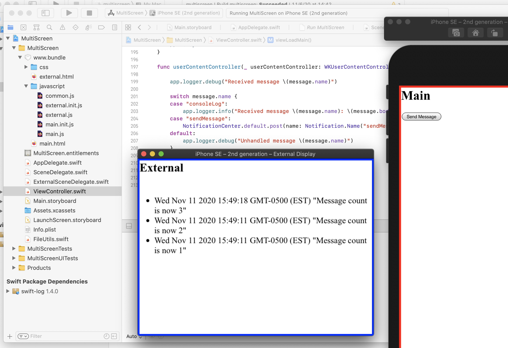

Very little. The application's main screen (as in the iOS device the application is running on) has button that, when pressed, causes a message to be printed on an external display connected to the "controller" iOS device.

This is just enough to demonstrate how to load different content on different displays and to communicate between the two and between the iOS and web application layers.

For a much more sophisticated example of what's possible have a look at Apple's [Discover WKWebView enhancements](https://developer.apple.com/videos/play/wwdc2020/10188) video from WWDC 2020.

## How does it work and what are the moving pieces?

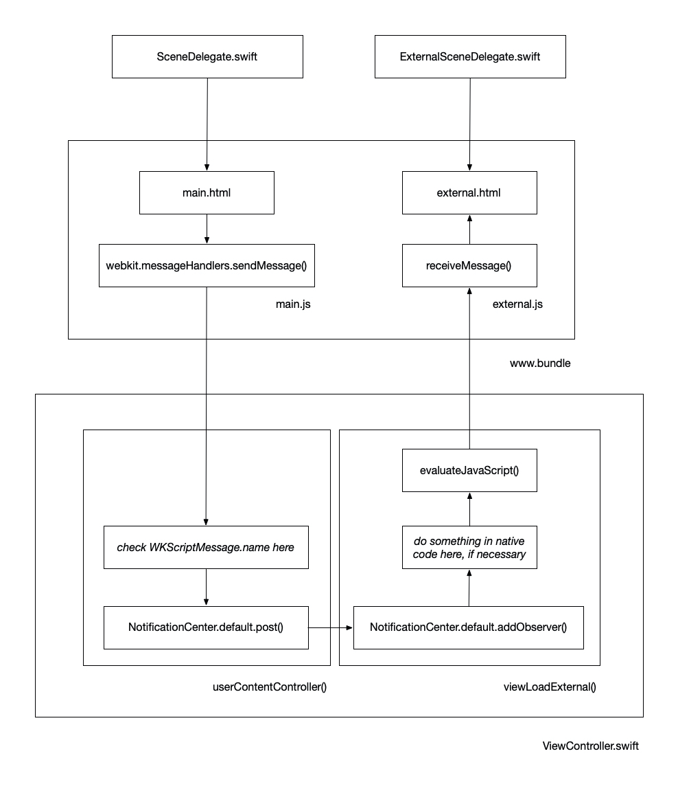

Keeping in mind that the diagram above is a _simplified_ overview of how things work:

* There is a single storyboard that contains a `WKWebKitView` element that fills all the available screen space.

* As of iOS 13 each display is handled by its own scene delegate. The built-in iPad display is handled by the default `SceneDelegate.swift` file and loads `www.bundle/main.html` in the web view. The external display is handled by the `ExternalSceneDelegate.swift` file which loads `www.bundle/external.html`.

* The `ViewController.swift` file contains separate code branches for each display. When either is loaded one or more JavaScript functions are registered with the webview using the `WKUserContentController.add` method.

* When invoked (using the `webkit.messageHandlers.{METHODNAME}.postMessage` method in the `www.bundle/*.js` files) these functions are dispatched to the `userContentController` function as `WKScriptMessage` instances.

* If the `WKScriptMessage` has the name "sendMessage" its message body is posted to the iOS `NotificationCenter` with the name "sendMessage".

* The `viewLoadExternal` method registers a `NotificationCenter` observer for notifications named "sendMessage" and, went received, forward them on to the web view using the `evaluateJavaScript("receiveMessage('\(msg)')"` method.

Simplified even further:

* Register methods that can be invoked from the JavaScript files in a `WKWebKitView` instance.

* Relay those methods, and their values, as `NotificationCenter` messages inside the `userContentController` method.

* Add observers for those messages in other parts of the code, perform work accordingly and then relay the result back to the `WKWebKitView` instance, in the form of a JavaScript function call and value, using the `evaluateJavaScript` method.

## "Hands free"

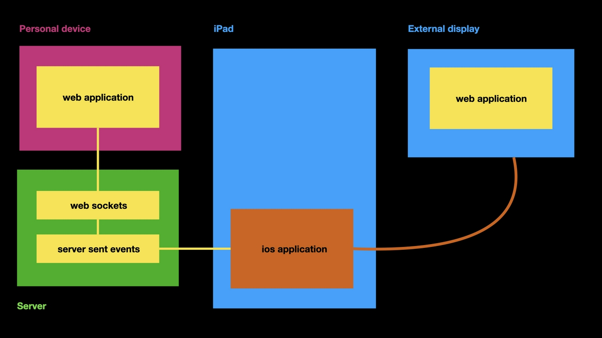

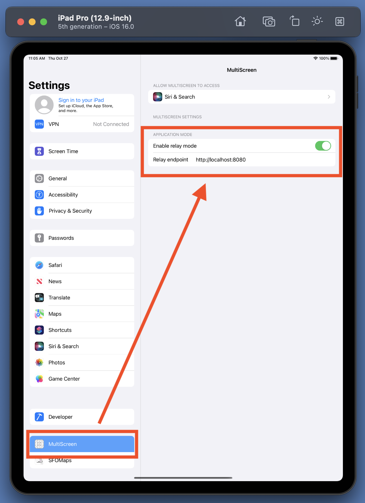

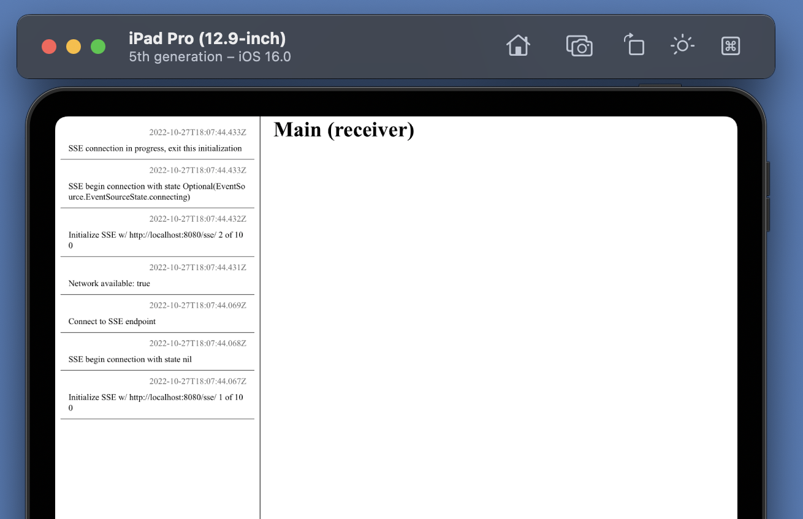

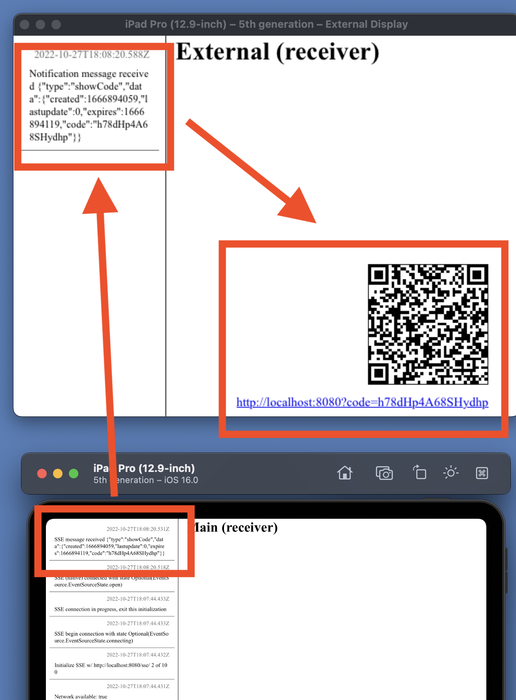

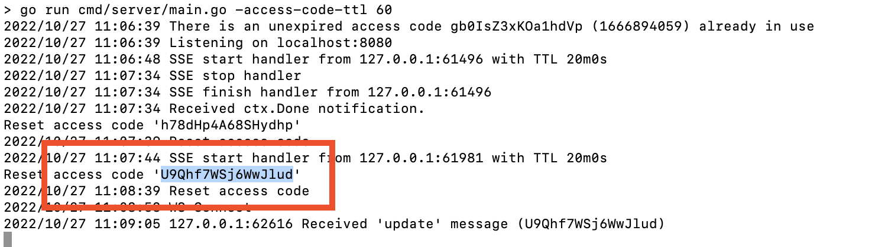

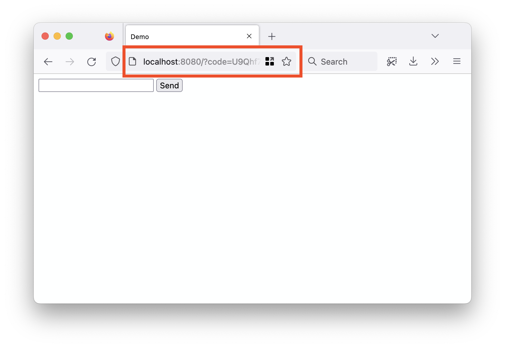

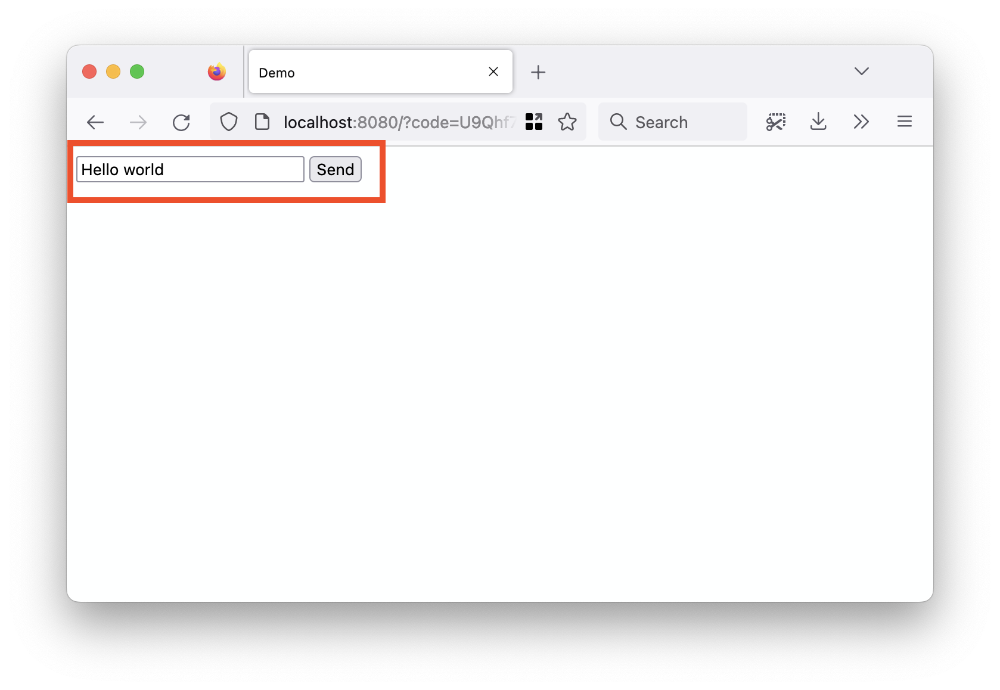

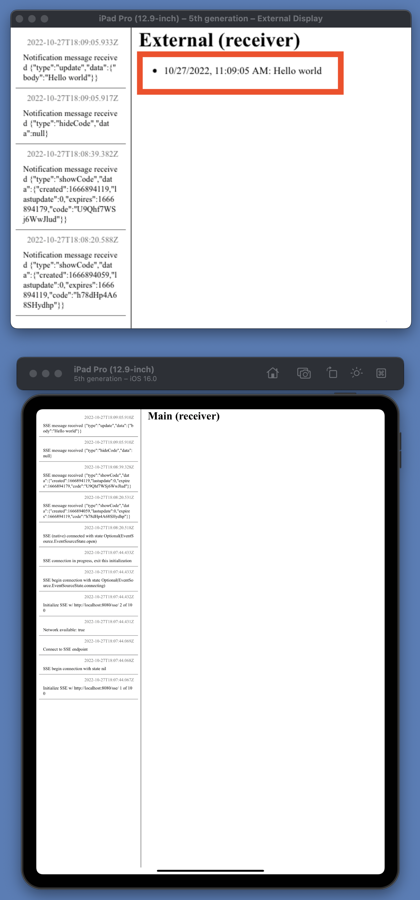

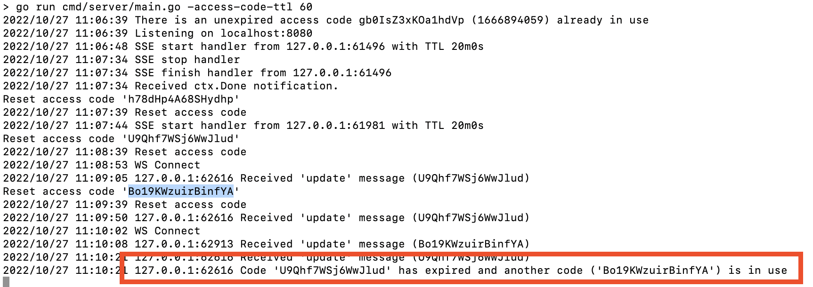

## See also

### WKWebView

* https://iosdevcenters.blogspot.com/2016/05/creating-simple-browser-with-wkwebview.html
* https://developer.apple.com/videos/play/wwdc2020/10188

### Notifications

* https://medium.com/@dmytro.anokhin/notification-in-swift-d47f641282fa

### UIScene, UIWindow and UIScreen

* https://www.donnywals.com/understanding-the-ios-13-scene-delegate/
* https://developer.apple.com/documentation/uikit/uiwindow
* https://developer.apple.com/documentation/uikit/uiscreen
* https://developer.apple.com/documentation/uikit/windows_and_screens/displaying_content_on_a_connected_screen

Out of date, with the introduction of `UIScene` but still useful:

* https://www.bignerdranch.com/blog/adding-external-display-support-to-your-ios-app-is-ridiculously-easy/
