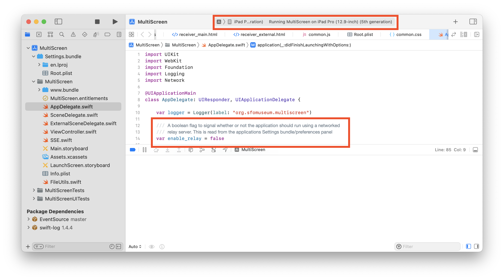
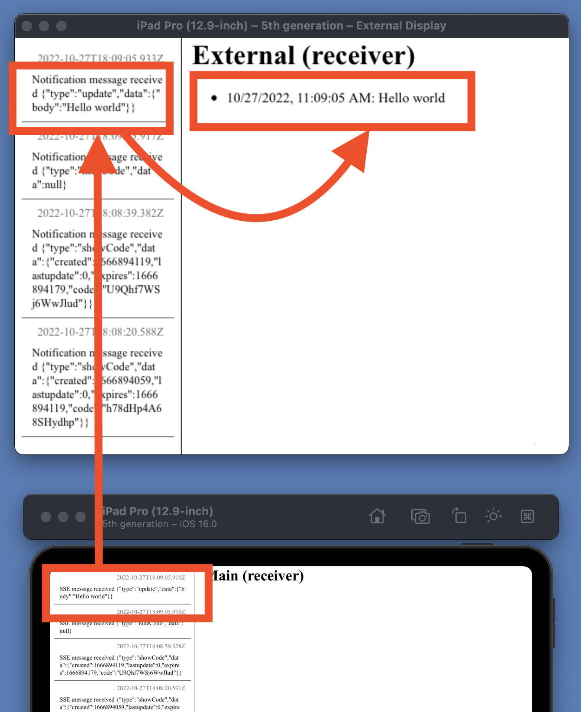

# ios-multiscreen-starter

Starter kit for developing hybrid iOS / web applications designed to run on a "controller" iOS device and mirrored to a passive external display.

We welcome [improvements and contributions](https://github.com/sfomuseum/ios-multiscreen-starter/issues).

## Important

This is meant to be a working _reference implementation_ for other applications. It is not designed to be an abstract container in to which a web application is placed. You don't need to be an XCode or a Swift expert but there is some expectation that you know the basics of how iOS applications work and can put together a (simple) project and compile it from scratch.

For a fuller discussion of motivations behind the project please have a look at the [iOS Multi-screen Starter Kit](https://millsfield.sfomuseum.org/blog/2020/11/18/multiscreen/) blog post.

## What does it do?

Very little. The application's main screen (as in the iOS device the application is running on) has button that, when pressed, causes a message to be printed on an external display connected to the "controller" iOS device.

This is just enough to demonstrate how to load different content on different displays and to communicate between the two and between the iOS and web application layers.

For a much more sophisticated example of what's possible have a look at Apple's [Discover WKWebView enhancements](https://developer.apple.com/videos/play/wwdc2020/10188) video from WWDC 2020.

## How does it work and what are the moving pieces?

Keeping in mind that the diagram above is a _simplified_ overview of how things work:

* There is a single storyboard that contains a `WKWebKitView` element that fills all the available screen space.

* As of iOS 13 each display is handled by its own scene delegate. The built-in iPad display is handled by the default `SceneDelegate.swift` file and loads `www.bundle/main.html` in the web view. The external display is handled by the `ExternalSceneDelegate.swift` file which loads `www.bundle/external.html`.

* The `ViewController.swift` file contains separate code branches for each display. When either is loaded one or more JavaScript functions are registered with the webview using the `WKUserContentController.add` method.

* When invoked (using the `webkit.messageHandlers.{METHODNAME}.postMessage` method in the `www.bundle/*.js` files) these functions are dispatched to the `userContentController` function as `WKScriptMessage` instances.

* If the `WKScriptMessage` has the name "sendMessage" its message body is posted to the iOS `NotificationCenter` with the name "sendMessage".

* The `viewLoadExternal` method registers a `NotificationCenter` observer for notifications named "sendMessage" and, went received, forward them on to the web view using the `evaluateJavaScript("receiveMessage('\(msg)')"` method.

Simplified even further:

* Register methods that can be invoked from the JavaScript files in a `WKWebKitView` instance.

* Relay those methods, and their values, as `NotificationCenter` messages inside the `userContentController` method.

* Add observers for those messages in other parts of the code, perform work accordingly and then relay the result back to the `WKWebKitView` instance, in the form of a JavaScript function call and value, using the `evaluateJavaScript` method.

## "Hands free"

The application can also be run in a "touch-free" mode allowing a person to control it (the application) using their mobile device. This is accomplished by replacing the default JavaScript-to-iOS bridge using a network-based equivalent provided by the [sfomuseum/www-multiscreen-starter](https://github.com/sfomuseum/www-multiscreen-starter) package.

Here's what that looks like:

Importantly, control of the application is limited to one person at a time through the use of time-sensitive access codes. For background on why this functionality was added see:

* [Presenting the SkyTerrace Interactive Map at NACIS 2022](https://millsfield.sfomuseum.org/blog/2022/10/28/nacis/) (slides and notes from [NACIS 2022](https://nacis.org/annual-meeting/) conference)

* [Interactive Maps of SFO from 1930 to 2021 (and Beyond) at the T2 SkyTerrace](https://www.youtube.com/watch?v=hZ2NXeul0Qs&list=PLcBEhOBZvhcbTn1RC0zWbnuHA81SgIg8b&index=36) (video presented at the [NACIS 2022](https://nacis.org/annual-meeting/) conference)

The following examples demonstrate the application run in "touch-free" mode using the XCode Simulator and an instance of the [sfomuseum/www-multiscreen-starter server](https://github.com/sfomuseum/www-multiscreen-starter#server) running on the same machine.

First, run the application targeting a 12.9" iPad.

Once the Simulator starts the first thing you'll need to do is enable "relay" mode in the application's settings panel. Note that the default relay endpoint is `http://localhost:8080` which is expected to be the `www-multiscreen-starter` server application running on the same machine.

Returning to the iOS application you'll see that the "main" window on the iPad doesn't show (or do) anything besides logging messages.

But when you add an external display to the application you'll see both logging information and a QR code (and a link).

Since it's not possible (??) to click those links in the simulator you'll need to go back to the terminal where you've started the `www-multiscreen-starter`	server application and copy the most recent access code that has been generated.

_See the [sfomuseum/www-multiscreen-starter documentation](https://github.com/sfomuseum/www-multiscreen-starter#server) for details on running the server._

Open `http://localhost:8080?code={THE_ACCESS_CODE_YOU_JUST_COPIED}` in a web browser and you'll see a bare-bones form for sending messages.

Type "Hello world" and then press the `Send` button.

When you return the Simluator you'll see your message being received by both the "main" and "external" windows.

Time passes, new access codes are generated and used. When the original access code is used to send a new message it is denied because newer access codes have started to send their own messages.

Questions and bug reports should be filed as [new issues in this repository](https://github.com/sfomuseum/ios-multiscreen-starter/issues).

## See also

### WKWebView

* https://iosdevcenters.blogspot.com/2016/05/creating-simple-browser-with-wkwebview.html
* https://developer.apple.com/videos/play/wwdc2020/10188

### Notifications

* https://medium.com/@dmytro.anokhin/notification-in-swift-d47f641282fa

### UIScene, UIWindow and UIScreen

* https://www.donnywals.com/understanding-the-ios-13-scene-delegate/
* https://developer.apple.com/documentation/uikit/uiwindow
* https://developer.apple.com/documentation/uikit/uiscreen
* https://developer.apple.com/documentation/uikit/windows_and_screens/displaying_content_on_a_connected_screen

Out of date, with the introduction of `UIScene` but still useful:

* https://www.bignerdranch.com/blog/adding-external-display-support-to-your-ios-app-is-ridiculously-easy/
